# Plan: Lotta Rust Server

**Status:** Accepted · **Layout:** kanban · **Date:** 2026-08-14 · **Owner:** Ant Stanley · **Source spec:** `.specs/` canonical set (`00-overview.md` through `07-channels-and-operations.md`, `architecture-principles.md`, `development-guidelines.md`, `canonical-types.schema.json`)

Lotta is a Rust implementation of the local Letta App Server. This plan decomposes the canonical
spec into 95 reviewable task packages across nine milestones. The reviewability spine is a thin
vertical slice: after the domain, port traits, testkit, and the checked-in compatibility corpora
(M1), the plan builds the smallest path that lets the unmodified baseline `app-server-client`
drive a real turn against fake ports (M2). Every later package is therefore reviewed through a
live client rather than only through unit tests. Persistence and MemFS (M3) replace the fake
store; tools, skills, and extension hosts (M4) and providers (M5) replace the remaining fakes;
the runtime completes (M6); the full command surface and OpenAI routes land (M7); channels and
operations follow (M8); and the conformance suites and the executable acceptance gate close the
plan (M9). Fixtures precede the code they constrain, and port traits precede both the runtime
that consumes them and the adapters that implement them. Every task inherits the Tiger Style
development guidelines as its definition-of-done baseline and carries a done certificate.

---

## Source and definition-of-done baseline

- **Spec.** The canonical set at `.specs/` — `00-overview.md` through `07-channels-and-operations.md`,
  plus `architecture-principles.md`, `development-guidelines.md`, and `canonical-types.schema.json`.
  In-scope coverage means every `##`/`###` section of pages `00`–`07` and `architecture-principles.md`
  except each page's closing `Assumptions and open questions` block. `development-guidelines.md` is the
  definition-of-done baseline below rather than a coverage target; `00-overview.md` §Problem, §Goals, and
  §Non-goals are framing rather than buildable surface. The parity baseline is `letta-ai/letta-code`
  version `0.30.20` at commit `300f923f16cc8eee50656d7da732902c1dea2b65`, verified in the adjacent
  checkout, with deployment behavior from `letta-app-server-deployment/letta-code-version.txt` at `0.30.20`.
- **Already built.** (Greenfield — nothing exists yet.) The repository contains only `.specs/`,
  `README.md`, `LICENSE` (Apache-2.0), and `NOTICE`. There is no Rust workspace, crate, source file,
  fixture, or CI configuration. The repository is a Git working copy with a `github.com/antstanley/lotta`
  remote, so CI is GitHub Actions.
- **Definition of done.** Each task's DoD inherits `.specs/development-guidelines.md` §Definition of done
  and §Limits and bounds: unit/integration/end-to-end coverage at the right boundary, negative-space and
  validity-boundary tests, touched core functions meeting the assertion and size rules (70 lines, 100
  columns), every new bound a named constant with units last and observable when reached, explicit error
  and cancellation paths, `cargo fmt --all --check`, `cargo clippy --workspace --all-targets --all-features
  -- -D warnings`, `cargo nextest run --workspace --all-features`, and `cargo deny check` all clean,
  schema and compatibility fixtures updated for protocol or domain changes, TypeScript↔Rust round-trip
  tests for persistence changes, accurate spec and architecture pointers, and a change description that
  states why and lists architecture-level effects. Task files add only task-specific acceptance on top.
- **Pointer convention.** Prospective Lotta paths (`crates/…`, `src/main.rs`, `fixtures/…`, `tests/…`)
  do not exist yet and are the artifacts a task creates. Baseline pointers are written relative to the
  repository root as `../letta-code/…` and every one of them resolves in the pinned checkout.

---

## Task graph

```mermaid
graph TD
  01["01 · workspace bootstrap + CI"]
  02["02 · domain IDs + scalars"]
  03["03 · domain persistent entities"]
  04["04 · domain runtime entities + state machines"]
  05["05 · domain errors + bounds"]
  06["06 · core port traits"]
  07["07 · provider port contract"]
  08["08 · tool port contract"]
  09["09 · testkit + port-contract suite"]
  10["10 · protocol enums + fixtures"]
  11["11 · persistence fixture corpus"]
  12["12 · provider stream fixtures"]
  13["13 · reference trace corpus"]
  14["14 · transport listener + auth"]
  15["15 · transport bounds + closure"]
  16["16 · runtime registry"]
  17["17 · lifecycle owner + leases"]
  18["18 · admission + queue"]
  19["19 · minimal turn loop"]
  20["20 · WS runtime commands + envelopes"]
  21["21 · vertical slice: client turn"]
  22["22 · store paths + atomic writes"]
  23["23 · agent + conversation records"]
  24["24 · transcript contract"]
  25["25 · baseline-compatible loading"]
  26["26 · migration + verification"]
  27["27 · side stores"]
  28["28 · required query patterns"]
  29["29 · MemFS Git repositories"]
  30["30 · prompt compilation"]
  31["31 · cross-runtime persistence"]
  32["32 · tool registry + toolsets"]
  33["33 · execution pipeline + clamps"]
  34["34 · permissions model"]
  35["35 · sandbox adapters"]
  36["36 · skills"]
  37["37 · file built-ins"]
  38["38 · shell/process built-ins"]
  39["39 · memory + worktree built-ins"]
  40["40 · planning/task/LSP built-ins"]
  41["41 · external tools"]
  42["42 · sidecar framing contract"]
  43["43 · MCP client"]
  44["44 · hooks"]
  45["45 · mod compatibility host"]
  46["46 · subagents"]
  47["47 · model handle + settings"]
  48["48 · retry + fallback"]
  49["49 · native API adapters"]
  50["50 · local endpoint adapters"]
  51["51 · pi-ai compatibility host"]
  52["52 · provider connections + auth.json"]
  53["53 · provider limits + conformance"]
  54["54 · turn setup"]
  55["55 · loop branches + stop reasons"]
  56["56 · approvals"]
  57["57 · cancellation + terminal"]
  58["58 · compaction + prompt refresh"]
  59["59 · runtime bounds + observability"]
  60["60 · schedule store + run logs"]
  61["61 · scheduler firing"]
  62["62 · WS external tools"]
  63["63 · WS teleport"]
  64["64 · WS terminal"]
  65["65 · WS files"]
  66["66 · WS memory"]
  67["67 · WS models/providers"]
  68["68 · WS schedules"]
  69["69 · WS skills + settings"]
  70["70 · WS agent management"]
  71["71 · WS conversation management"]
  72["72 · WS device + introspection"]
  73["73 · sync + recovery"]
  74["74 · OpenAI /v1/models"]
  75["75 · OpenAI /v1/chat/completions"]
  76["76 · OpenAI /v1/responses"]
  77["77 · OpenAI golden fixtures"]
  78["78 · channel topology + control plane"]
  79["79 · channel management protocol"]
  80["80 · channel accounts + routing"]
  81["81 · channel access control + pairing"]
  82["82 · channel command surface"]
  83["83 · configuration + CLI"]
  84["84 · telemetry + health"]
  85["85 · composition root + shutdown"]
  86["86 · deployment image"]
  87["87 · backup + restore"]
  88["88 · failure injection"]
  89["89 · security suite"]
  90["90 · SDK conformance"]
  91["91 · Desktop smoke"]
  92["92 · ChannelGateway conformance"]
  93["93 · reliability traces"]
  94["94 · acceptance gate"]
  95["95 · docs + release"]

  01 --> 02
  02 --> 03
  02 --> 04
  03 --> 04
  02 --> 05
  04 --> 06
  05 --> 06
  06 --> 07
  06 --> 08
  07 --> 09
  08 --> 09
  04 --> 10
  05 --> 10
  09 --> 11
  07 --> 12
  09 --> 12
  09 --> 13
  10 --> 13
  05 --> 14
  05 --> 15
  14 --> 15
  06 --> 16
  09 --> 16
  16 --> 17
  05 --> 18
  17 --> 18
  09 --> 19
  18 --> 19
  10 --> 20
  15 --> 20
  16 --> 20
  18 --> 20
  19 --> 20
  09 --> 21
  13 --> 21
  20 --> 21
  06 --> 22
  09 --> 22
  03 --> 23
  11 --> 23
  22 --> 23
  03 --> 24
  11 --> 24
  22 --> 24
  11 --> 25
  24 --> 25
  11 --> 26
  25 --> 26
  11 --> 27
  22 --> 27
  23 --> 28
  24 --> 28
  25 --> 28
  06 --> 29
  09 --> 29
  22 --> 29
  03 --> 30
  29 --> 30
  11 --> 31
  23 --> 31
  24 --> 31
  25 --> 31
  26 --> 31
  27 --> 31
  30 --> 31
  08 --> 32
  09 --> 32
  32 --> 33
  27 --> 34
  32 --> 34
  33 --> 34
  34 --> 35
  27 --> 36
  29 --> 36
  30 --> 36
  33 --> 37
  34 --> 37
  35 --> 37
  33 --> 38
  34 --> 38
  35 --> 38
  29 --> 39
  33 --> 39
  34 --> 39
  35 --> 39
  33 --> 40
  34 --> 40
  36 --> 40
  32 --> 41
  33 --> 41
  05 --> 42
  09 --> 42
  32 --> 43
  33 --> 43
  42 --> 43
  33 --> 44
  35 --> 44
  32 --> 45
  42 --> 45
  44 --> 45
  29 --> 46
  32 --> 46
  39 --> 46
  42 --> 46
  03 --> 47
  07 --> 47
  07 --> 48
  09 --> 48
  07 --> 49
  12 --> 49
  48 --> 49
  07 --> 50
  12 --> 50
  48 --> 50
  12 --> 51
  42 --> 51
  48 --> 51
  22 --> 52
  27 --> 52
  47 --> 52
  05 --> 53
  12 --> 53
  49 --> 53
  50 --> 53
  51 --> 53
  18 --> 54
  28 --> 54
  30 --> 54
  32 --> 54
  34 --> 54
  36 --> 54
  41 --> 54
  44 --> 54
  45 --> 54
  47 --> 54
  19 --> 55
  33 --> 55
  48 --> 55
  54 --> 55
  55 --> 56
  17 --> 57
  38 --> 57
  55 --> 57
  24 --> 58
  47 --> 58
  55 --> 58
  05 --> 59
  55 --> 59
  57 --> 59
  58 --> 59
  27 --> 60
  18 --> 61
  60 --> 61
  20 --> 62
  41 --> 62
  20 --> 63
  20 --> 64
  38 --> 64
  20 --> 65
  37 --> 65
  20 --> 66
  29 --> 66
  30 --> 66
  20 --> 67
  47 --> 67
  52 --> 67
  20 --> 68
  60 --> 68
  61 --> 68
  20 --> 69
  27 --> 69
  36 --> 69
  20 --> 70
  23 --> 70
  28 --> 70
  20 --> 71
  23 --> 71
  24 --> 71
  28 --> 71
  58 --> 71
  18 --> 72
  20 --> 72
  44 --> 72
  45 --> 72
  18 --> 73
  20 --> 73
  56 --> 73
  20 --> 74
  23 --> 74
  47 --> 74
  15 --> 75
  55 --> 75
  74 --> 75
  71 --> 76
  75 --> 76
  13 --> 77
  74 --> 77
  75 --> 77
  76 --> 77
  20 --> 78
  42 --> 78
  10 --> 79
  20 --> 79
  78 --> 79
  03 --> 80
  27 --> 80
  79 --> 80
  27 --> 81
  80 --> 81
  41 --> 82
  80 --> 82
  81 --> 82
  05 --> 83
  14 --> 83
  15 --> 83
  05 --> 84
  22 --> 84
  83 --> 84
  20 --> 85
  42 --> 85
  55 --> 85
  57 --> 85
  78 --> 85
  83 --> 85
  84 --> 85
  85 --> 86
  22 --> 87
  23 --> 87
  24 --> 87
  27 --> 87
  29 --> 87
  52 --> 87
  22 --> 88
  42 --> 88
  45 --> 88
  46 --> 88
  57 --> 88
  73 --> 88
  85 --> 88
  14 --> 89
  34 --> 89
  35 --> 89
  52 --> 89
  84 --> 89
  85 --> 89
  70 --> 90
  71 --> 90
  73 --> 90
  85 --> 90
  64 --> 91
  69 --> 91
  73 --> 91
  85 --> 91
  79 --> 92
  81 --> 92
  82 --> 92
  85 --> 92
  13 --> 93
  73 --> 93
  85 --> 93
  10 --> 94
  31 --> 94
  53 --> 94
  77 --> 94
  87 --> 94
  88 --> 94
  89 --> 94
  90 --> 94
  91 --> 94
  92 --> 94
  93 --> 94
  86 --> 95
  94 --> 95
```

The dependency table is the **source of truth**; the Mermaid graph visualizes it.
If the two ever disagree, the table wins — fix the graph to match.

| Task | Depends on | Edge kind | Produces (reviewable artifact) |
|---|---|---|---|
| 01 · workspace bootstrap + CI | — | — | a 13-crate Rust workspace with a root composition-root binary that builds clean and runs every toolchain gate in GitHub Actions |
| 02 · domain IDs + scalars | 01 | build | typed, opaque ID newtypes and validated scalars that accept every baseline ID form and never rewrite a client-supplied ID |
| 03 · domain persistent entities | 02 | build | every persisted entity as a Rust type that round-trips through the exact canonical-types schema shape, including the 25-field Schedule and the snake_case channel records |
| 04 · domain runtime entities + state machines | 02, 03 | build | the four-state turn machine, lease tokens, and runtime projections that make contradictory activity states unrepresentable |
| 05 · domain errors + bounds | 02 | build | one typed error enum per crate boundary plus every `01-domain-model.md` resource bound as a units-last named constant that is observable when reached |
| 06 · core port traits | 04, 05 | build | the port traits every adapter implements, defined in `lotta-runtime` so the runtime never links a concrete adapter crate |
| 07 · provider port contract | 06 | build | the `ProviderRequest`/`ProviderEvent`/`ProviderError` contract exactly as `06-model-providers.md` specifies it, so no vendor type can reach the runtime |
| 08 · tool port contract | 06 | build | the `ToolPort` trait and the tool definition/outcome records every executor, MCP server, controller tool, mod, and channel gateway implements |
| 09 · testkit + port-contract suite | 07, 08 | build, contract | deterministic clocks and IDs, in-memory port fakes, and one shared contract suite that every concrete adapter and its fake must pass |
| 10 · protocol enums + fixtures | 04, 05 | build, contract | one tagged command enum and one tagged message enum whose variant lists are proven equal to a checked-in fixture extracted from the pinned TypeScript unions |
| 11 · persistence fixture corpus | 09 | build | a sanitized `fixtures/persistence/` corpus covering the seven cross-runtime cases, checked in before any store code that it constrains |
| 12 · provider stream fixtures | 07, 09 | contract, data | a sanitized `fixtures/providers/` corpus of captured baseline streams plus their expected normalized `ProviderEvent` traces, checked in before any adapter |
| 13 · reference trace corpus | 09, 10 | contract, data | a `fixtures/reference-traces/` corpus of baseline command/event traces for the queue, abort, disconnect, stale-lease, retry, idempotency, and crash-recovery reliability surfaces |
| 14 · transport listener + auth | 05 | build | an Axum listener that binds the baseline URL forms and enforces both `--ws-auth` modes, rejecting unauthenticated Origin-bearing clients even on loopback |
| 15 · transport bounds + closure | 05, 14 | build | the nine transport bounds enforced before proportional work, plus stable HTTP/WebSocket error envelopes and half-open reaping |
| 16 · runtime registry | 06, 09 | build, contract | a `(AgentId, ConversationId)`-keyed registry with idempotent creation, an explicit residency predicate, and immediate eviction once quiescent |
| 17 · lifecycle owner + leases | 16 | build | one lifecycle owner per scope that issues leases and suppresses every effect from a stale lease at each awaited boundary |
| 18 · admission + queue | 05, 17 | build | a serialized admission chain and per-runtime FIFO queue with baseline coalescing at the soft tier, visible rejection at the hard tier, and a snapshot on every mutation |
| 19 · minimal turn loop | 09, 18 | build, contract | a turn that streams provider events, persists text and reasoning projections, executes one sequential local tool, and completes exactly once — all against fake ports |
| 20 · WS runtime commands + envelopes | 10, 15, 16, 18, 19 | build, contract | the Runtime command group decoded, routed, and answered with correctly enveloped, ordered events on a per-connection sequence |
| 21 · vertical slice: client turn | 09, 13, 20 | contract, review | the unmodified baseline `app-server-client` completing `runtime_start` → `input` → `stream_delta` → `turn_finished` against the Rust server with fake ports, matching the recorded reference trace |
| 22 · store paths + atomic writes | 06, 09 | build, contract | base64url path encoding for both baseline key forms plus atomic temp-flush-rename writes that return `storage_conflict` on an observed external change |
| 23 · agent + conversation records | 03, 11, 22 | build, data | agent JSON and conversation snapshots that round-trip against the checked-in corpus, preserve unknown fields, and refresh on external mtime change |
| 24 · transcript contract | 03, 11, 22 | build, data | schema-v2 transcript JSONL with the exact manifest, one session header, and append-only message and compaction entries |
| 25 · baseline-compatible loading | 11, 24 | build, data | a loader that accepts everything the reference accepts and repairs the active projection without mutating the source transcript |
| 26 · migration + verification | 11, 25 | build, data | an idempotent, backup-first migration command and a non-mutating `verify` command reporting the six diagnostic classes |
| 27 · side stores | 11, 22 | build, data | read/write access to `settings.json`, `crons.json`, schedule run logs, the channel store tree, and project-local settings at their exact baseline paths |
| 28 · required query patterns | 23, 24, 25 | build, data | the ten required query behaviors including the `letta-msg-`/`ui-msg-` projection mapping and deterministic list ordering |
| 29 · MemFS Git repositories | 06, 09, 22 | build, contract | one Git repository per agent under the backend root with the baseline label normalization and the full operation set |
| 30 · prompt compilation | 03, 29 | build, data | `system-prompt.json` with exactly the six compatibility fields and cache reuse keyed on `rawSystemHash` and `memfsRevision` |
| 31 · cross-runtime persistence | 11, 23, 24, 25, 26, 27, 30 | data, review | proof that TypeScript and Rust round-trip the backend root, provider auth, schedules, settings, and channel side stores in both directions without loss |
| 32 · tool registry + toolsets | 08, 09 | build, contract | the six toolset IDs with per-toolset model-facing names, `auto` resolution, allowlist filtering, and side-built registries swapped atomically |
| 33 · execution pipeline + clamps | 32 | build | the ordered hook→permission→sandbox→secret-substitution→executor→post-hook→scrub→clamp→persist→emit pipeline with the baseline result clamps |
| 34 · permissions model | 27, 32, 33 | build, data | the four permission modes with the `unrestricted` default, three file-backed scopes plus the legacy XDG path, and shell-analysis bypass rejection |
| 35 · sandbox adapters | 34 | build | macOS Seatbelt and Linux Bubblewrap adapters plus an explicit unsupported error, with workspace roots confining all filesystem tools and child processes |
| 36 · skills | 27, 29, 30 | build, data | skill discovery in the exact four-level precedence with the baseline optional-frontmatter fallbacks and runtime source restriction |
| 37 · file built-ins | 33, 34, 35 | build | the ten file built-ins — read, write, edit, multi-edit, apply-patch, list, glob, grep, image view, and artifact-file read/write — under policy, sandbox, and clamps |
| 38 · shell/process built-ins | 33, 34, 35 | build | one-shot shell/exec, PTY session, background output, stdin, monitor, stop, and timeout under sandbox with the baseline output bounds |
| 39 · memory + worktree built-ins | 29, 33, 34, 35 | build, data | memory edit and patch operations with Git commit and path confinement, plus worktree enter/exit with an ownership lock and provisioning |
| 40 · planning/task/LSP built-ins | 33, 34, 36 | build | `update_plan`/`UpdatePlan`, `TodoWrite`, the six task lifecycle tools, the skill loader, the approval and ask-user bridge, and `ReadLSP` diagnostics |
| 41 · external tools | 32, 33 | build | controller-owned tool registration at `runtime_start` and by atomic update, with scoped calls, the fixed five-minute timeout, and typed owner-disconnect rejection |
| 42 · sidecar framing contract | 05, 09 | build | one versioned length-prefixed JSON framing used by the provider host, the mod host, and the subagent host, validated at the child-to-host boundary |
| 43 · MCP client | 32, 33, 42 | build, contract | a Rust MCP client supporting `stdio`, `sse`, and `http` with namespaced bounded discovery and atomic per-server refresh |
| 44 · hooks | 33, 35 | build | the eleven hook events with the prompt-hook subset restriction, sandboxed command hooks, and per-owner failure attribution |
| 45 · mod compatibility host | 32, 42, 44 | build, contract | a versioned JSON-RPC mod host over the shared sidecar framing, with declared-capability scoping, reload, dispose, generation invalidation, diagnostics, safe mode, and `--no-mods` |
| 46 · subagents | 29, 32, 39, 42 | build, contract | the seven built-in subagent types spawned as a pinned Letta Code subprocess over the shared sidecar, with bounded snapshots and filesystem confinement |
| 47 · model handle + settings | 03, 07 | build | stable model handles with the four-level resolution order and a model update that validates availability before persistence |
| 48 · retry + fallback | 07, 09 | build, contract | a deterministic, jitter-free retry policy owned by the runtime, plus explicit transport fallback that never mutates the persisted model |
| 49 · native API adapters | 07, 12, 48 | build, data | two native adapters whose normalized traces match the captured baseline fixtures event for event |
| 50 · local endpoint adapters | 07, 12, 48 | build, data | Ollama, Ollama Cloud, LM Studio, and llama.cpp adapters with native endpoint discovery tested separately from the static pi-ai catalog |
| 51 · pi-ai compatibility host | 12, 42, 48 | build, contract | a compatibility host pinning resolved `@earendil-works/pi-ai` `0.82.1` over the shared sidecar, serving the full built-in catalog, Codex/ChatGPT OAuth, and mod-defined providers |
| 52 · provider connections + auth.json | 22, 27, 47 | build, data | baseline-compatible plaintext `providers/auth.json` v1 with restrictive modes, redaction, and disconnect that refuses while turns are active unless forced |
| 53 · provider limits + conformance | 05, 12, 49, 50, 51 | data, review | every `06-model-providers.md` limit enforced and the gate proving a native adapter and the compatibility host emit equivalent traces for the same fixture |
| 54 · turn setup | 18, 28, 30, 32, 34, 36, 41, 44, 45, 47 | build, data | the ten-step turn setup in the specified order, with the two documented failure modes distinguishable by recovery |
| 55 · loop branches + stop reasons | 19, 33, 48, 54 | build, contract | the four tool-call branches, context-pressure and retry paths, and the distinct typed stop reasons of the §Provider and tool loop diagram |
| 56 · approvals | 55 | build | approval requests stored before emission, resolution validated against the original schema, and a 24-hour interruption that never becomes an implicit denial |
| 57 · cancellation + terminal | 17, 38, 55 | build | the six-step cancellation sequence with interrupted-result normalization, two-stage child kill, and exactly one `turn_finished(cancelled)` |
| 58 · compaction + prompt refresh | 24, 47, 55 | build, data | both compaction modes with all three triggers, mod lifecycle callbacks, before/after counts, and revision-driven prompt refresh |
| 59 · runtime bounds + observability | 05, 55, 57, 58 | build, review | the ten runtime bounds enforced with progress assertions, and structured events and metrics that exclude prompts, message bodies, tool inputs, and secrets |
| 60 · schedule store + run logs | 27 | build, data | `crons.json` persistence for the full Schedule shape with cron and interval parsing, IANA timezones, and rotated per-schedule run logs |
| 61 · scheduler firing | 18, 60 | build, data | a lease-aware scheduler that enqueues `cron_prompt` through the conversation queue and never bypasses it |
| 62 · WS external tools | 20, 41 | build, contract | runtime external-tool update and external-tool-call response commands routed to the Task 41 registry with correct correlation |
| 63 · WS teleport | 20 | build, contract | `teleport_probe`/`teleport_request`/`teleport_failed` with the two response messages and `input.kind = teleport_continue` continuation |
| 64 · WS terminal | 20, 38 | build, contract | `terminal_spawn`/`terminal_input`/`terminal_resize`/`terminal_kill` scoped by connection and `terminal_id`, with the two-second Strict-Mode reuse window |
| 65 · WS files | 20, 37 | build, contract | search, grep, list directory, tree, read, write, edit, watch, unwatch, and file operations as listener services under the same path policy as file tools |
| 66 · WS memory | 20, 29, 30 | build, contract | list, history, read-at-ref, read, write, delete, diff, and enable MemFS commands over the Task 29 repository |
| 67 · WS models/providers | 20, 47, 52 | build, contract | list models, list/connect/disconnect providers, usage read, and update model/toolset commands over the Task 47 and 52 surfaces |
| 68 · WS schedules | 20, 60, 61 | build, contract | cron list, add, get, runs, trigger, update, delete, and delete-all commands over the Task 60 store and Task 61 scheduler |
| 69 · WS skills + settings | 20, 27, 36 | build, contract | skills enable/disable plus the settings group — cwd map, reflection settings, and experiments |
| 70 · WS agent management | 20, 23, 28 | build, contract | create shortcut plus list, retrieve, create, update, and delete for agents, backed by the Task 28 query behaviors |
| 71 · WS conversation management | 20, 23, 24, 28, 58 | build, contract | list, retrieve, create, update, recompile, fork, messages, and compact for conversations, including the transcript rewrite that fork requires |
| 72 · WS device + introspection | 18, 20, 44, 45 | build, contract | slash/mod command execution, remove queue item, branch search/checkout, secret list/apply, `app_server_info`, and coverage of all six outbound message groups |
| 73 · sync + recovery | 18, 20, 56 | build, contract | `sync` replaying authoritative snapshots rather than an event-ID delta, with reconnect subscription and sequence recovery and restart approval recovery |
| 74 · OpenAI /v1/models | 20, 23, 47 | build, contract | `GET /v1/models` listing up to 1,000 visible agents as OpenAI model objects, with agent-name and agent-ID resolution and `model_not_found` errors |
| 75 · OpenAI /v1/chat/completions | 15, 55, 74 | build, contract | stateful, header-keyed, and stateless chat completions with `Idempotency-Key` caching, in-flight sharing, and failed-outcome eviction |
| 76 · OpenAI /v1/responses | 71, 75 | build, contract | the Responses subset with unsigned `resp_letta_` cursors, `previous_response_id` hidden fork, and `501 unsupported_backend` when forking is unavailable |
| 77 · OpenAI golden fixtures | 13, 74, 75, 76 | data, review | checked-in golden fixtures for all three routes, replayed against the running server with event-by-event SSE comparison |
| 78 · channel topology + control plane | 20, 42 | build, contract | a supervised channel-host child speaking App Server WebSocket for runtime data and newline-delimited JSON over stdin/stdout for management |
| 79 · channel management protocol | 10, 20, 78 | build, contract | exactly the twenty baseline channel service commands and the four push events, with names matching `types/service-protocol.ts` verbatim |
| 80 · channel accounts + routing | 03, 27, 79 | build, data | the six first-party channel IDs with custom-plugin loading, and the seven-step inbound flow through routing to `runtime_start` and `MessageChannel` |
| 81 · channel access control + pairing | 27, 80 | build, data | central sender gating before commands or routes, the three-policy access model, single-use bounded pairing codes, and the operational bounds table |
| 82 · channel command surface | 41, 80, 81 | build, contract | the eleven shared operational commands with tiered authorization and help-instead-of-transcript for unsupported commands |
| 83 · configuration + CLI | 05, 14, 15 | build | the `lotta server` and `lotta local-backend` CLI surface with validated configuration and secret references, and no configuration format beyond what the spec authorizes |
| 84 · telemetry + health | 05, 22, 83 | build, review | structured JSON daemon logs with the required fields and centralized scrubbing, plus the four health, readiness, capability, and metrics endpoints |
| 85 · composition root + shutdown | 20, 42, 55, 57, 78, 83, 84 | build, review | the workspace-root `src/main.rs` binary composing every adapter and executing the eight-step SIGTERM/SIGINT sequence, with lazy restart reload |
| 86 · deployment image | 85 | build | a non-root container image with the documented mounts, default command, and supervised channel host, alongside the deployment-variant comparison |
| 87 · backup + restore | 22, 23, 24, 27, 29, 52 | build, data | a quiesced backup of the backend root, side stores, and MemFS repositories, encrypted with an operator-supplied key and restored only after full validation |
| 88 · failure injection | 22, 42, 45, 46, 57, 73, 85 | review | proof of baseline queue semantics, Lotta atomic-write and conflict hardening, cancellation, stale-lease suppression, reconnect recovery, and sidecar crash handling |
| 89 · security suite | 14, 34, 35, 52, 84, 85 | review | proof of non-loopback authentication, Origin rejection, path confinement, secret redaction, and sandbox policy against the assembled binary |
| 90 · SDK conformance | 70, 71, 73, 85 | review | the remote-backend conformance suite creating, resuming, streaming, compacting, forking, and deleting local agents and conversations without client patches |
| 91 · Desktop smoke | 64, 69, 73, 85 | review | a Desktop client connecting, syncing state, executing a turn, approving a tool, changing cwd, and reconnecting against the assembled binary |
| 92 · ChannelGateway conformance | 79, 81, 82, 85 | review | the existing ChannelGateway client driving a Rust App Server runtime through pairing, routing, turn, and reply fixtures |
| 93 · reliability traces | 13, 73, 85 | review | the seven reliability traces replayed against the assembled binary with matching queue, abort, disconnect, stale-lease, retry, idempotency, and crash-recovery behavior |
| 94 · acceptance gate | 10, 31, 53, 77, 87, 88, 89, 90, 91, 92, 93 | review | one executable gate that fails unless every `00-overview.md` §Implementation acceptance criterion and every §Compatibility definition surface is proven green |
| 95 · docs + release | 86, 94 | review | rustdoc without warnings, an architecture and operations guide, a compatibility statement, and a release checklist whose items are executable commands |

Each row keys a task by its **number and title** (`01 · workspace bootstrap + CI`), **not** a path
hyperlink — a task file moves between subfolders as it is built, so a reader or tool finds it by
globbing its number across the four subfolders (`*/01-*.md`). Keying by number keeps `plan.md` stable:
it is never rewritten when a task moves. `Depends on` references **lower** task numbers — a property of
numbering in implementation order; if a row depends on a higher number, either the order or the
dependency is wrong. Edge kind names why the dependency exists — build / data / contract / review (see
task-decomposition.md).

---

## Implementation order and milestones

**Order:** `01, 02, 03, 04, 05, 06, 07, 08, 09, 10, 11, 12, 13, 14, 15, 16, 17, 18, 19, 20, 21, 22, 23, 24, 25, 26, 27, 28, 29, 30, 31, 32, 33, 34, 35, 36, 37, 38, 39, 40, 41, 42, 43, 44, 45, 46, 47, 48, 49, 50, 51, 52, 53, 54, 55, 56, 57, 58, 59, 60, 61, 62, 63, 64, 65, 66, 67, 68, 69, 70, 71, 72, 73, 74, 75, 76, 77, 78, 79, 80, 81, 82, 83, 84, 85, 86, 87, 88, 89, 90, 91, 92, 93, 94, 95` — the spine leads with the workspace and domain (01–05), then the port
traits (06–08) so the runtime never links a concrete adapter, then the testkit and shared
port-contract suite (09) and the four compatibility corpora (10–13) so every fixture that can
falsify a later package is checked in before that package is written. M2 (14–21) is the
departure from a naive dependency-only sort: transport, registry, lease, queue, a minimal loop,
and WS routing are scheduled ahead of the real store, providers, and tools purely so a real
client can drive a real turn from task 21 onward. Persistence and MemFS (22–31) then replace
the fake store. Tools, permissions, skills, and the extension hosts (32–46) precede turn setup
because `03-runtime-and-turns.md` §Turn setup steps 5–9 require skills, mods, hooks, and a
resolved toolset; scheduling them earlier is what makes the order a valid topological sort.
Providers (47–53) then complete the adapter set, the runtime completes and schedules land
(54–61), the full command surface and OpenAI routes follow (62–77), channels and operations
close the product surface (78–87), and the conformance suites and acceptance gate (88–95)
prove the acceptance criteria.

**Milestones:**

| Milestone | Tasks | Demonstrable when complete | Review gate (executable) |
|---|---|---|---|
| M1 — foundations, ports, and compatibility corpus | 01-13 | the workspace builds and every gate is green in CI; the domain, port traits, testkit, and shared port-contract suite exist; the protocol discriminant fixture and the persistence, provider-stream, and reference-trace corpora are checked in | `cargo nextest run --workspace --all-features` green; `cargo nextest run -p lotta-protocol -E 'test(manifest::)'` proves Rust variants equal the extracted fixture; the extractor re-run produces no diff; `cargo nextest run -p lotta-testkit -E 'test(contract::)'` runs one suite invocation per port; `cargo nextest run -p lotta-testkit -E 'test(fixtures::)'` proves all three corpora are indexed and sanitized |
| M2 — thin vertical compatibility slice | 14-21 | the unmodified baseline `app-server-client` connects to the Rust binary, starts a runtime, sends input, receives stream deltas, and observes `turn_finished` against fake store, provider, and tool ports | `cargo nextest run --test slice` green with the observed trace matching `fixtures/reference-traces/slice_happy_turn.json`; all six `02-app-server-api.md` §Event envelopes and ordering invariants hold over the live capture; `git -C ../letta-code status --porcelain` clean, proving no client patch |
| M3 — persistence and MemFS | 22-31 | the real store and MemFS replace the fakes: agent, conversation, transcript, side-store, and prompt state read and write at the baseline paths, and TypeScript and Rust hand off the same root in both directions | `cargo nextest run --test cross_runtime` green in both directions for the backend root, all five side stores, and all seven `04-persistence-and-memfs.md` §Migration cases; `cargo nextest run --test slice` still green; `lotta local-backend verify` reports diagnostics on a fixture without mutating it |
| M4 — tools, skills, and extension hosts | 32-46 | the model-facing tool surface matches the pinned registry, permissions and sandbox gate every call, and skills, hooks, MCP, mods, and subagents load through one shared bounded sidecar contract | `cargo nextest run -p lotta-tools` and `-p lotta-extensions` green; `cargo nextest run -p lotta-tools -E 'test(builtin::planning::registered_names)'` proves no invented tool name; grep for a second sidecar framing implementation returns nothing; `cargo nextest run --test slice` still green |
| M5 — providers | 47-53 | native OpenAI-compatible, Anthropic, and local-endpoint adapters and the pinned pi-ai compatibility host all replay the captured baseline streams to identical normalized traces | `cargo nextest run -p lotta-providers` green; `cargo nextest run --test provider_equivalence` proves native-versus-host trace equivalence with all ten `06-model-providers.md` §Conformance dimensions covered; `cargo nextest run -p lotta-runtime -E 'test(retry::deterministic_delays)'` run twice yields identical delay sequences |
| M6 — runtime completion and schedules | 54-61 | a full turn runs against real adapters with approvals, cancellation, compaction, and bounds, and schedules fire through the conversation queue | `cargo nextest run -p lotta-runtime` green including `setup::step_order`, `approval::timeout_interrupts`, `cancel::exactly_once`, `compaction::triggers`, and `scheduler::enqueues_through_queue`; every `03-runtime-and-turns.md` §Runtime bounds constant has below/at/above coverage |
| M7 — App Server command surface and OpenAI HTTP | 62-77 | every `02-app-server-api.md` §WebSocket command group is served, `sync` replays authoritative snapshots, and all three OpenAI routes answer golden fixtures | `cargo nextest run -p lotta-app-server -E 'test(ws::)'` covers every command group with fixture round-trips and all six outbound message groups; `cargo nextest run --test openai_golden` green with event-by-event SSE comparison; grep for a `last_event_id` sync parameter returns nothing |
| M8 — channels and operations | 78-87 | a supervised channel host drives the server over the twenty baseline management commands, and the binary configures, reports health, shuts down in eight steps, ships as a non-root image, and backs up and restores | `cargo nextest run -p lotta-channels -E 'test(protocol::command_set_is_exactly_twenty)'` green; `cargo nextest run -E 'test(shutdown::step_order)'` green against a real SIGTERM with no orphan process; `docker build .` succeeds and the container answers `/readyz` as a non-root user; a backup/restore round trip reproduces the source tree hashes |
| M9 — conformance and release | 88-95 | every `00-overview.md` §Implementation acceptance criterion and every §Compatibility definition surface is proven by an executable suite, and the release checklist runs end to end | the Task 94 acceptance gate exits 0 and emits a report naming all six criteria and all nine surfaces with their suites green; every command in `RELEASE-CHECKLIST.md` produces its stated expected result |

---

## Assumptions and open questions

**Assumptions**

- The adjacent Letta Code checkout at `../letta-code/` stays available at commit `300f923f` while the compatibility corpora and conformance suites are built.
- Rust stable with edition 2024 supports the selected Tokio, Axum/Tower, and WebSocket stack with the cancellation and backpressure semantics the runtime requires.
- The existing Agent SDK, Desktop, and ChannelGateway client packages can run as black-box conformance drivers in CI without patches.
- Git is available as an external executable for the initial MemFS adapter.
- `../letta-app-server-deployment/` stays available as the deployment behavior reference.
- Sanitized request, stream, and event captures may be retained in `fixtures/` for testing without carrying credentials or user content.

**Decisions**

- *Decomposition shape.* **Nine milestones, 95 tasks, each with about six definition-of-done items.** `task-decomposition.md` §Sizing treats more than roughly six acceptance items as two packages wearing one id. The wider surfaces — every WebSocket command group, every built-in tool family, every bound table — are cut into their own packages rather than folded into epics.
- *Reviewability spine.* **A thin vertical slice at task 21, before the real store, providers, or tools exist.** A layer-by-layer order would leave nothing exercisable by a real client until the transport landed. Scheduling transport, registry, lease, queue, a minimal loop, and WS routing against fake ports makes every subsequent package reviewable through the unmodified baseline client.
- *Fixtures before code.* **The protocol, persistence, provider-stream, and reference-trace corpora are extracted in tasks 10-13.** `architecture-principles.md` §Assumptions *Compatibility evidence* states prose and Rust types alone cannot prove wire parity. Extracting the corpora after the code they constrain would defer discovery of a wrong storage key, prompt shape, or stream ordering to the final milestone.
- *Port placement.* **Port traits live in `lotta-runtime::ports`; adapters implement them and depend on the runtime crate for the traits alone.** `architecture-principles.md` §Dependency graph requires `lotta-runtime` to depend on domain and port traits and never on concrete adapters, and explicitly permits adapter crates to depend on runtime interfaces. Co-locating a port with its adapters — `ProviderPort` beside six vendor adapters — would invert that edge. This keeps the canonical 13-crate layout unchanged.
- *Composition root.* **The binary is the workspace-root `src/main.rs`.** `architecture-principles.md` §Workspace layout places it there and annotates it `composition root only`; task 01 creates it, task 85 fills it, and task 86 packages it, so no crate-local `main.rs` exists to disagree with.
- *Sequential tools by default.* **Tool definitions default to a sequential parallel-safety classification.** `03-runtime-and-turns.md` §Assumptions records which built-in tools are certified parallel-safe as an open question. Executing concurrently by default would decide it silently, so the classification is a field on the definition and the conservative value is the default.
- *One sidecar framing.* **Task 42 defines the length-prefixed JSON framing that the provider host, the mod host, the MCP stdio transport, and the subagent host all reuse.** `development-guidelines.md` §Where to validate treats the child-to-host boundary as first class. Three independently defined sidecar protocols would each need their own frame, version, owner, capability, and timeout validation, and would be mutually incompatible by construction.
- *CI provider.* **GitHub Actions.** The repository is a Git working copy with a public `github.com/antstanley/lotta` remote, so the hosted runner is available without adding infrastructure. Task 01's definition of done is therefore dischargeable rather than blocked.
- *Renumbering.* **The whole plan was renumbered during remediation.** `checklist.md` §When the checklist finds a problem item 6 permits renumbering while a plan has not been executed against. Every task is still in `backlog/`, and the previous order was not a valid topological sort — turn setup and the provider/tool loop preceded the tool registry and permissions they require.

**Open questions**

- *Origin policy.* Which browser origins, if any, are accepted alongside authenticated native clients (`02-app-server-api.md` §Open questions)? Until answered, task 14 requires every Origin-bearing client to authenticate and task 89 tests that behavior. (Blocks widening task 14; does not block building it.)
- *TLS termination.* Does Lotta terminate TLS directly or require a reverse proxy for non-loopback deployments (`02-app-server-api.md` §Open questions)? Tasks 86 and 89 assume deployment-provided TLS. (Blocks a TLS-termination task, which is not scheduled.)
- *Parallel tools.* Which built-in tools are certified parallel-safe (`03-runtime-and-turns.md` §Open questions)? Tasks 08, 19, and 37-40 default every tool to sequential and carry the classification as data. (Blocks a future concurrency task; the default is safe without it.)
- *Approval expiry configurability.* Is a 24-hour approval expiry acceptable for all Desktop and channel workflows, or should the bound be configurable below a larger hard maximum (`03-runtime-and-turns.md` §Open questions)? Task 56 implements the fixed bound with interruption semantics. (Blocks making `APPROVAL_WAIT_MS_MAX` configurable.)
- *Crash recovery depth.* Is restart recovery limited to approvals and durable turns, or must in-flight provider streams resume from run IDs (`03-runtime-and-turns.md` §Open questions)? Tasks 73 and 88 restore state, not streams. (Blocks a stream-resume task.)
- *Live credential encryption.* Should a future change spec introduce keyring or encrypted provider storage with a TypeScript migration path (`04-persistence-and-memfs.md` and `06-model-providers.md` §Open questions)? Task 52 keeps the live `auth.json` plaintext and task 87 encrypts backups with an operator-supplied key. (Blocks any live-encryption task.)
- *Schema source of truth.* Is Rust the eventual schema source, or does the pinned TypeScript protocol keep generating compatibility fixtures (`architecture-principles.md` §Open questions)? Tasks 10-13 extract from TypeScript. (Blocks reversing the generation direction.)
- *Configuration format.* Should Lotta gain a configuration-file format and environment-variable prefix beyond the documented CLI flags and `LETTA_HOME`/`LETTA_LOCAL_BACKEND_DIR`? No canonical page defines one, so task 83 ships flags only. (Blocks a configuration-file task; a change spec must define the format first.)
- *Native subagent replacement.* At which parity milestone does Lotta replace the Letta Code subprocess compatibility path for subagents (`05-tools-and-extensions.md` §Open questions)? Task 46 ships only the compatibility path. (Blocks a native-subagent task.)
- *Channel host ownership.* Is the existing Letta Code channel host reused unchanged or extracted into a smaller pinned package (`07-channels-and-operations.md` §Open questions)? Task 78 supervises it unchanged. (Blocks an extraction task.)
- *Deployment repository.* Should `letta-app-server-deployment` gain a Lotta profile or should Lotta use a separate deployment repository (`07-channels-and-operations.md` §Open questions)? Task 86 ships an image plus a documented comparison. (Blocks contributing a profile upstream.)
- *Baseline support window.* How many Letta Code protocol baselines must Lotta support concurrently after `0.30.20` (`00-overview.md` §Open questions)? Every corpus is pinned to `300f923f`. (Blocks a multi-baseline task.)
- *Coverage policy.* What branch or line thresholds supplement the behavior-based conformance gates (`development-guidelines.md` §Open questions)? Task 94 gates on suites, not coverage percentages. (Blocks adding a coverage threshold to the gate.)
